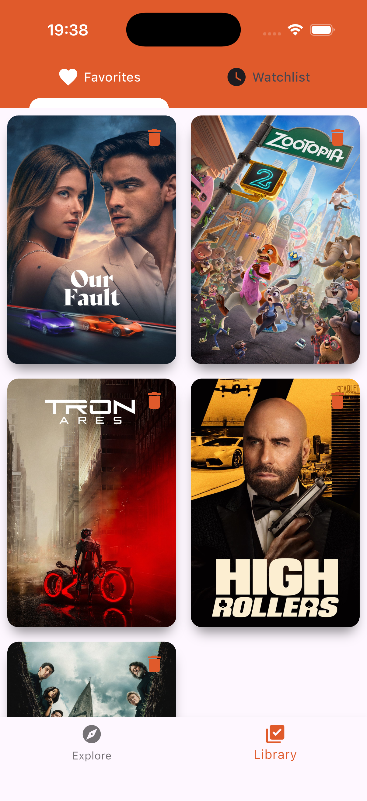
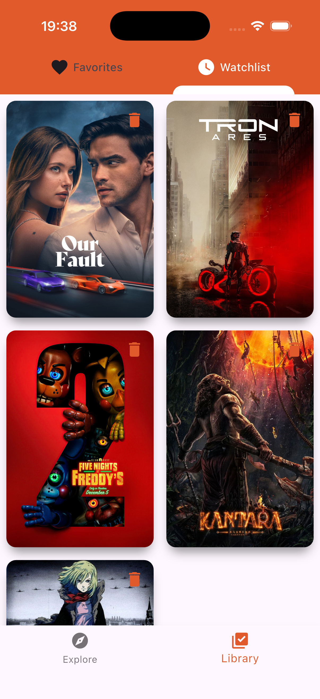
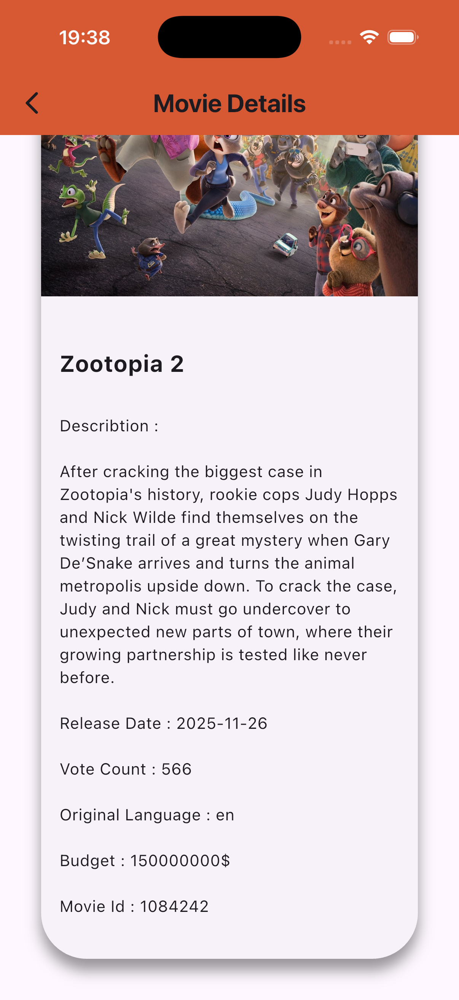

🎬 MovieDB Flutter

Same movie app built with different state management approaches.

## Screenshots

  
  
  
  

| Folder | State Management |
|--------|------------------|
| [moviedb_getx](./MovieDB_getx/) | GetX |
| [moviedb_provider](./MovieDB_provider/) | Provider |

## Tech Stack
- Flutter & Dart
- TMDB API
