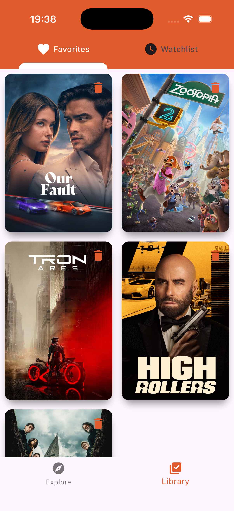
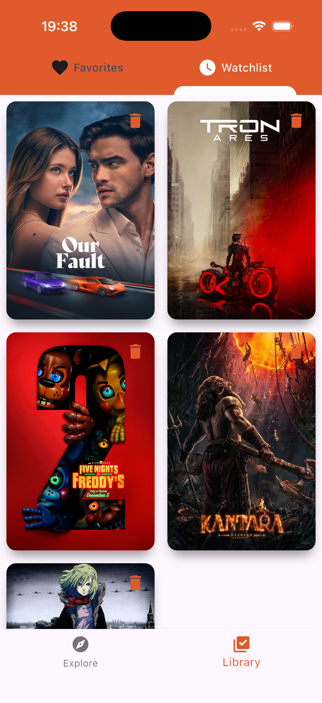
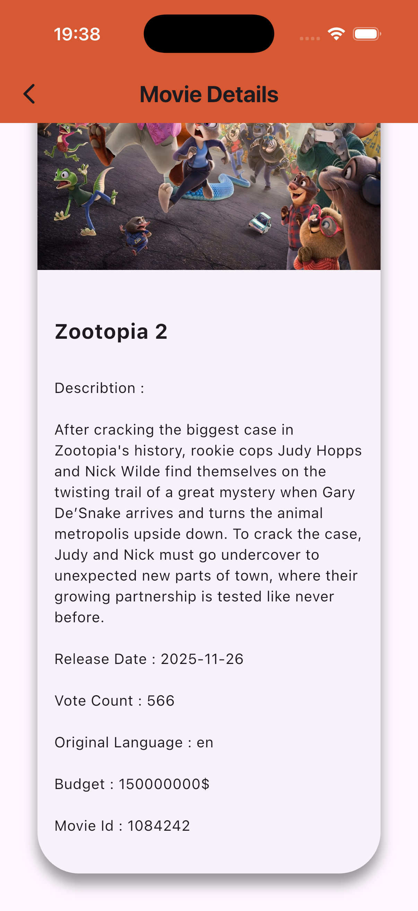

# 🎬 MovieDB Flutter

The same movie app built with different state-management approaches, powered by the [TMDB](https://www.themoviedb.org) API.


<p align="center">
  
  
  
  
</p>

## Variants

| Folder | State Management |
|--------|------------------|
| [moviedb_getx](./MovieDB_getx/) | GetX |
| [moviedb_provider](./MovieDB_provider/) | Provider |

## Tech Stack

| | |
|---|---|
| Framework | Flutter & Dart |
| State management | GetX, Provider |
| Data | TMDB API |

## Setup

1. Choose your preferred state-management project folder
2. Follow the guide in `lib/api_constants_example.dart` to add your TMDB key
3. Fetch dependencies and run:
   ```bash
   flutter pub get
   flutter run
   ```

---

*This product uses the TMDB API but is not endorsed or certified by TMDB.*
